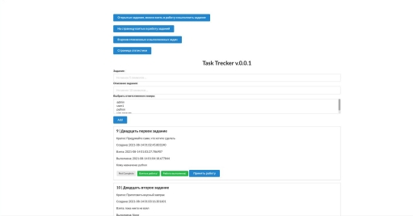
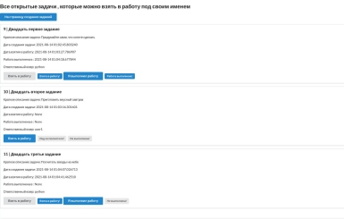
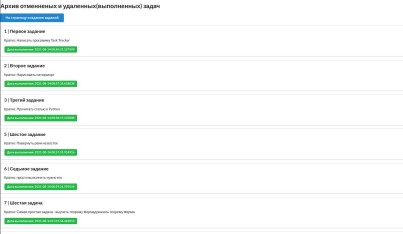
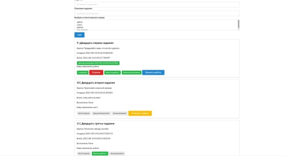

<h2>Task Trecker v.0.0.1</h2>

<h3>Requirements</h3>
 <li>Python3 (3.6-3.9)</li>
 <li>Flask</li>
 <li>SQLAlchemy Core</li>
 <li>SQLite</li>

   
<h3>Installation</h3>
 <li>python -m pip --upgrade pip</li>
 <li>python -m pip install pipenv</li>  
 <li>pipenv install -r requirements.txt</li>
   
<h3>Data base MariDB</h3>
users = 'id', Integer, primary_key=True, nullable=False
        'login', String(100), unique=True, nullable=False
        'password', String(100), nullable=False
        'data_create_user', DateTime
              
tasks = 'id', Integer, primary_key=True, nullable=False
        'title', String(100), unique=True
        'note', String(100), nullable=False
        'status', Boolean, default=0
        'data_create_task', DateTime
        'data_take_work', DateTime
        'take_work_status', Boolean, default=0
        'data_get_done', DateTime
        'get_done_status', Boolean, default=0
        'delete_status', Boolean, default=0
        'cancel_status', Boolean, default=0
        'data_cancel', DateTime
        'user_id', ForeignKey("users.id")
                                                                         
<h3>Data base load dump</h3>
     - todo_002.db.sql
     - tasks.json
     - users.json
     - todo_002.db

<h3>How to use</h3>
 <li>python  app.py</li>

<h3>Tested on</h3>
    <li>Manjaro</li>
    <li>Debian</li>
    <li>Fedora</li>

<h3>Give it a Star</h3>
If you find this repo useful , 
give it a star so as many people can get to know it.

